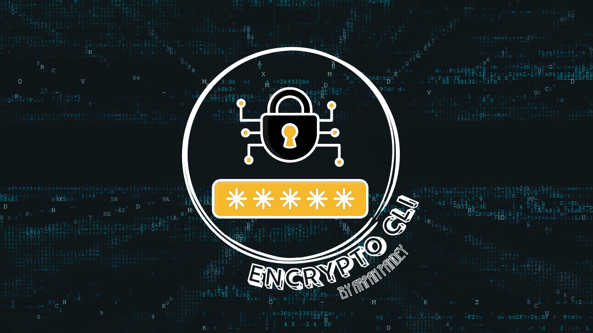
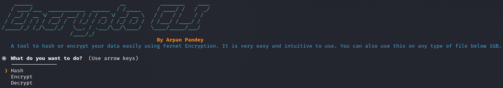
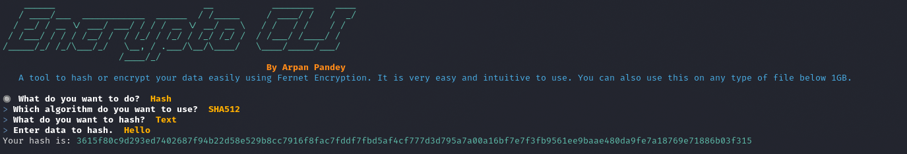
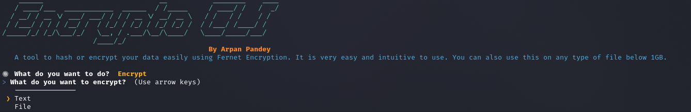
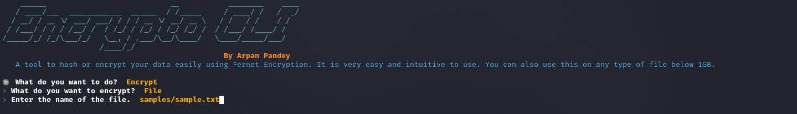
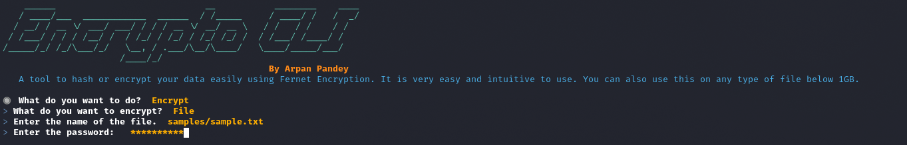
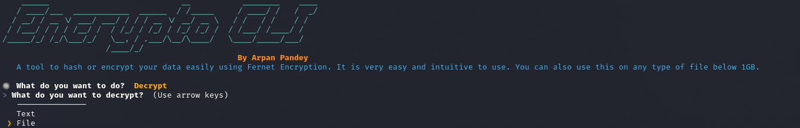
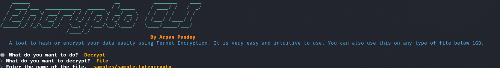
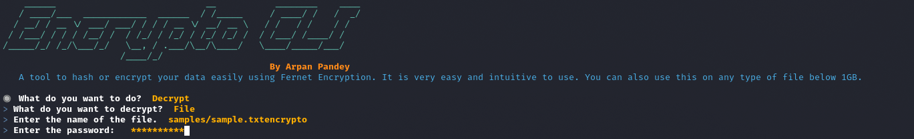

# EncryptoCLI - By Arpan Pandey


## 📚 Description
Encrypto CLI is a command-line program that provides you with an intuitive and easy-to-use program that allows for a highly efficient and customizable interface to generate hashes of files or encrypt them. This allows you to encrypt and decrypt files or text data. This is all powered by the [Fernet](https://cryptography.io/en/latest/fernet/) Encryption.    

## Technologies Used
* Python3
* Cryptography Module (Fernet Encryption)
* Hashing Module
* Termcolor
* InquirerPy
* Scrypt

## How it works?
The idea is very simple. The program first asks you about which operation do you want to perform and then asks you 2-3 questions relative to which operation you have selected.    

## Hashing
You can generate hashes for text or file data by selecting the algorithm from the 5 options provided: 

The five algorithms supported are:
* MD5
* SHA256
* SHA512
* BLAKE2
* BLAKE2b

Also, if you are interested in an analysis of these algorithms or implementing them by yourself you can head over to this article that I wrote on [hashing](https://hackersreboot.tech/articles/Cryptography/hashing).

## Encrypting 
You can encrypt data by going through these steps.
1. Select the type of data you want to encrypt. 
2. Input the data (either the text or path to a file). 
3. Enter a password. 
4. And you are done.

## Decrypting 
You can decrypt data by going through these steps.
1. Select the type of data you want to decrypt. 
2. Input the data (either the text or path to a file). 
3. Enter the password. 
4. And you are done.

## Steganography
You can encrypt and hide your data in an image using lsb method of steganography ( internally uses [stegano](https://stegano.readthedocs.io/en/latest/module.html) package )

### Encrypt

1. Select the type of data you want to encrypt.
2. Select **Image** as output type 
3. Input path to the image where your secret will be hidden
4. Enter the text/secret you want to encrypt and hide
5. Enter a password.
4. And you are done your secret has been hidden in the image named "encrypto.png"


### Decrypt

1. Select **Image** as the type of data you want to decrypt.
3. Input path to the image file you want to decrypt.
4. Enter the text/secret you want to encrypt and hide
5. Enter the password. 
4. And you are done.


## 🐋 Docker
You can pull this image from Docker Hub and build it very easily.
1. Just pull the image. 
    ```bash
    docker pull arpanpandey/encrypto:latest
    ```
OR 

1. You can build the image using.
    ```bash
    docker build --pull --rm -f "Dockerfile" -t arpanpandey/encrypto:latest "."
    ```

2. Running the container with the image (Be sure to put the `-t` and `-d` flag.)
    ```bash
    docker run -t -d arpanpandey/encrypto:latest
    ```

## License
This project is licensed under the MIT License.

### Video Demo
You can access the video demo at [https://youtu.be/Zmf2EK9jPCw](https://youtu.be/Zmf2EK9jPCw)

### Contributors 🏆🏆

<a href="https://github.com/Arpan-206/EncryptoCLI/graphs/contributors">


### MY BLOG
https://hackersreboot.tech/

#### Thank You!
Thanks a lot to the team at CS50 for teaching me so much about the fascinating world of computer science and program.


